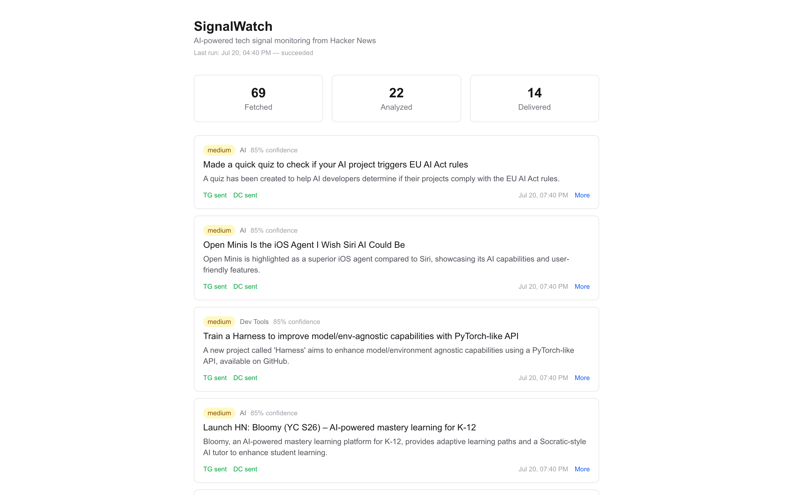
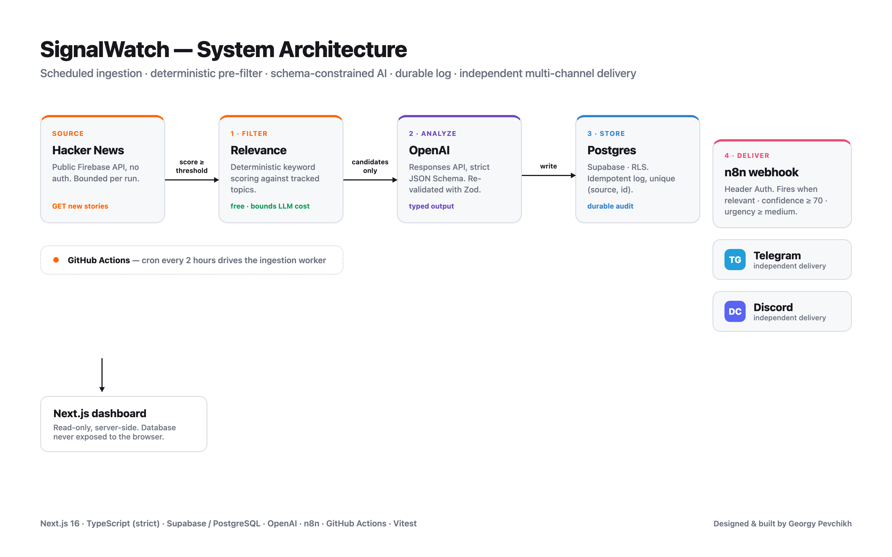
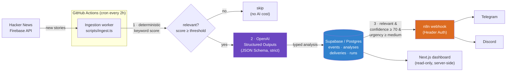

<div align="center">

# 📡 SignalWatch

### An automated tech-signal monitor that reads Hacker News so you don't have to

**Scheduled ingestion · deterministic pre-filter · schema-constrained LLM analysis · durable Postgres log · independent multi-channel delivery**

[](https://signalwatch-one.vercel.app)
[](https://github.com/georgypevchikh/signalwatch/actions/workflows/ci.yml)
[](https://nextjs.org/)
[](https://www.typescriptlang.org/)
[](https://platform.openai.com/docs/guides/structured-outputs)
[](https://supabase.com/)
[](https://n8n.io/)

**Designed and built independently by [Georgy Pevchikh](https://github.com/georgypevchikh).**

</div>



## The project in one sentence

SignalWatch watches [Hacker News](https://news.ycombinator.com/), filters stories against tracked topics, uses an LLM to analyze the relevant ones with **strict, schema-constrained output**, stores everything in Postgres, and pushes high-signal alerts to **Telegram** and **Discord** — each channel delivered independently through an authenticated n8n webhook.

|  |  |
|---|---|
| **Status** | Live and publicly deployed |
| **Role** | Product Engineer — architecture, implementation, deployment |
| **Shape** | Scheduled worker (GitHub Actions) + read-only Next.js dashboard |
| **Dashboard** | [Open the live dashboard](https://signalwatch-one.vercel.app) |
| **What it proves** | API ingestion → bounded LLM cost → typed AI output → durable audit log → idempotent multi-channel delivery |

This is not a demo toy. It is a running pipeline with a deterministic pre-filter that keeps LLM spend predictable, strict typed AI output re-validated before it's trusted, an idempotent Postgres log, and independent per-channel delivery — production concerns, not a screenshot.

## Architecture



<details>
<summary>Text version of the diagram</summary>



</details>

## How the pipeline works

1. **Fetch** — pull recent stories from the public Hacker News Firebase API (no auth), bounded per run.
2. **Deterministic pre-filter** — score each story against `tracked_topics` (keyword/phrase weighting) *before* touching the LLM. Only stories over the threshold become AI candidates, so LLM spend stays bounded and predictable.
3. **AI analysis** — candidates go to OpenAI's Responses API with a **strict JSON Schema**, returning a validated `SignalAnalysis` (summary, why-it-matters, suggested action, urgency, category, confidence). Output is re-validated with Zod before it's trusted.
4. **Durable log** — events, analyses, deliveries and run metadata are written to Postgres. Ingestion is **idempotent** via a unique `(source, external_id)` constraint, so re-runs never double-process.
5. **Delivery** — signals that are relevant, confident (≥70), and at least medium urgency are dispatched to n8n over an authenticated webhook. Telegram and Discord are delivered **independently**; ambiguous outcomes (timeouts) are recorded as `unknown` rather than silently marked sent.
6. **Dashboard** — a read-only Next.js app renders the signal feed server-side. The database is never exposed to the browser.

## Stack

| Layer | Technology |
|---|---|
| Worker / dashboard | Next.js 16 · TypeScript (strict) · Tailwind |
| AI | OpenAI Responses API · JSON Schema · Zod validation |
| Data | Supabase / PostgreSQL · Row-Level Security |
| Delivery | n8n (Header Auth webhook) → Telegram · Discord |
| Automation | GitHub Actions (scheduled ingestion + CI) |
| Tests | Vitest |

## Security

- All secrets are server-only and live in `.env.local` (gitignored) — never shipped to the client.
- The read-only dashboard depends on **only** the Supabase URL and key; the OpenAI key and n8n secret stay with the ingestion worker, so the public deployment holds the minimum secret surface.
- Database access uses the service-role key **only** on the server; RLS is enabled and all grants are revoked from `anon` / `authenticated`.
- A **Husky pre-commit hook** scans staged files for common key patterns; **gitleaks** and `npm audit` run in CI.
- The n8n webhook is protected with Header Auth.

## Local development

```bash
npm install
cp .env.example .env.local   # fill in your own credentials
npm run dev                  # dashboard at http://localhost:3000
npm run ingest               # run the ingestion pipeline once
```

Apply the database schema from `supabase/migrations/` in your Supabase project's SQL editor, in order.

## Tests & CI

```bash
npm test        # Vitest: schema + relevance scoring
npm run lint
npm run build
```

CI (`.github/workflows/ci.yml`) runs typecheck, lint, tests, build and a production `npm audit` on every push. Scheduled ingestion (`.github/workflows/ingest.yml`) runs every 2 hours.

## Configuring what it watches

Tracked topics are rows in the `tracked_topics` table (keywords, phrases, exclusions, per-topic threshold). Changing what SignalWatch monitors is a data change — no code edits required. The reference n8n delivery workflow is exported (with secrets redacted) in [`n8n/signalwatch-delivery.json`](n8n/signalwatch-delivery.json).

---

<div align="center">

**Designed and built independently by [Georgy Pevchikh](https://github.com/georgypevchikh).**

</div>
